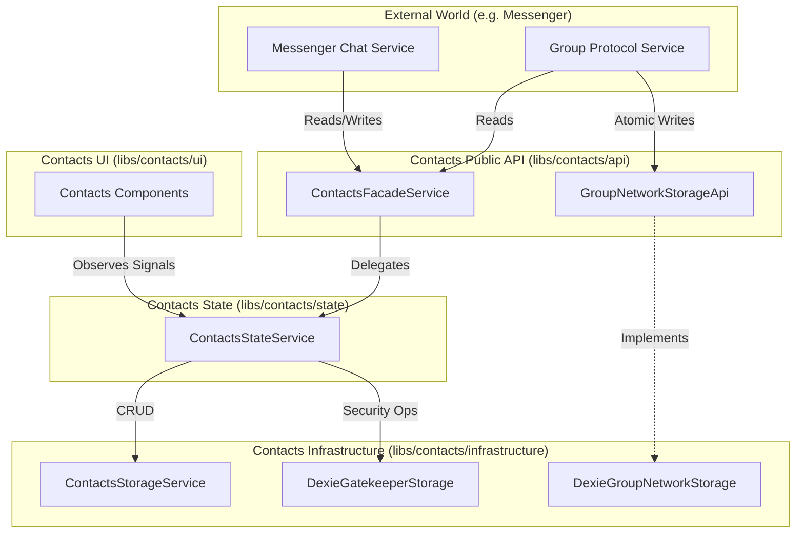

# Contacts Domain Architecture

This document defines the architectural boundaries, data flow, and "Rules of Engagement" for the Contacts domain. It serves as the mental model for future development and refactoring.

## 1. Architectural Graph

The Contacts domain follows a strict **unidirectional data flow**, with a single Facade for external access and a centralized State service for internal consistency.

---

## 2. Layer Responsibilities & Rules

### **A. Public API (`libs/contacts/api`)**

- **Role:** The exclusive entry point for all libraries _outside_ of the Contacts domain (e.g., `messenger`, `shell`).
- **Primary Component:** `ContactsFacadeService`.
- **Responsibility:** \* Implements abstract contracts (`AddressBookApi`, `GatekeeperApi`) defined in the API library.
- Delegates **all** logic to the internal `ContactsStateService`.
- **Rule:** Never contains business logic. It is a passthrough layer.

### **B. Internal UI (`libs/contacts/ui`)**

- **Role:** User interface components (e.g., Contact List, Security Settings).
- **Responsibility:**
- Consumes data via reactive **Signals** exposed by `ContactsStateService`.
- **Rule:** Must **never** import from `contacts-api` or `contacts-storage`. It interacts strictly with the State layer.

### **C. State Layer (`libs/contacts/state`)**

- **Role:** The **Single Source of Truth** for the application session.
- **Primary Component:** `ContactsStateService`.
- **Responsibility:**
- Holds the canonical state (Contacts, Groups, Pending Requests, Blocked Users) as Signals.
- Orchestrates complex business logic (e.g., "Blocking a user also removes them from Pending").
- Delegates persistence to the Infrastructure layer.

### **D. Infrastructure (`libs/contacts/infrastructure`)**

- **Role:** Dumb data access and persistence.
- **Primary Components:** `ContactsStorageService`, `DexieGatekeeperStorage`, `DexieGroupNetworkStorage`.
- **Responsibility:**
- Handles database read/write operations (Dexie.js).
- **Rule:** Zero business logic. Just `put`, `get`, `delete`, and `liveQuery`.

---

## 3. The Exception: `GroupNetworkStorageApi`

While most access goes through the State layer to ensure UI reactivity, the **Group Protocol** requires a different pattern.

- **Component:** `GroupNetworkStorageApi` (Port) / `DexieGroupNetworkStorage` (Adapter).
- **Consumer:** `GroupProtocolService` (Messenger Domain).
- **Behavior:** Bypasses `ContactsStateService` and accesses Infrastructure directly.
- **Rationale:**

1. **Atomic Consistency:** The protocol performs high-frequency, atomic writes (e.g., "User X joined Group Y at Time T") based on network consensus. These must be committed to disk immediately without side effects.
2. **No Optimistic UI:** Protocol operations are background synchronization tasks. The UI does not need to optimistically update; it will eventually reflect the changes when the `liveQuery` in the State layer detects the database update.
3. **Performance:** Routing high-throughput protocol traffic through the State service's change detection machinery creates unnecessary overhead.
