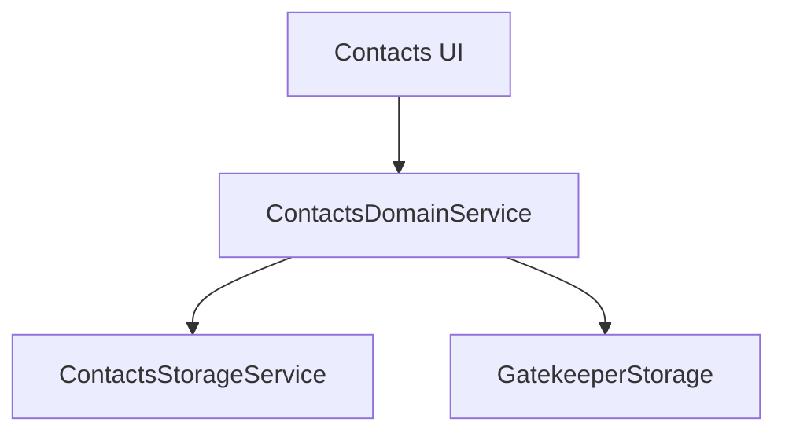

# 🏛️ Contacts Domain Service

**Scope:** `libs/contacts/domain/service`
**Type:** `domain`

This library contains the **Business Logic** for the Contacts Scope. It manages the user's private Address Book and Local Groups.

> **Role:** "The Manager" — It orchestrates Local Storage and Gatekeeper rules. It is strictly **local** and does not depend on the Network Directory.

---

## 🔑 Responsibilities

1.  **Address Book Management:** Creating, updating, and deleting local contacts.
2.  **Local Groups:** Managing groups that exist only on this device (e.g., "Gym Friends").
3.  **Gatekeeper Facade:** coordinating the blocking/pending logic via the underlying storage.

## 📦 Architecture

## ⚠️ Boundary Rules

- **No Network Dependency:** This service **must not** import `DirectoryMutationApi` or `DirectoryQueryApi`. It assumes the "Directory" is a separate concern managed by the Messenger scope.
- **Pure Orchestration:** It delegates actual persistence to `contacts-infrastructure-storage`.
