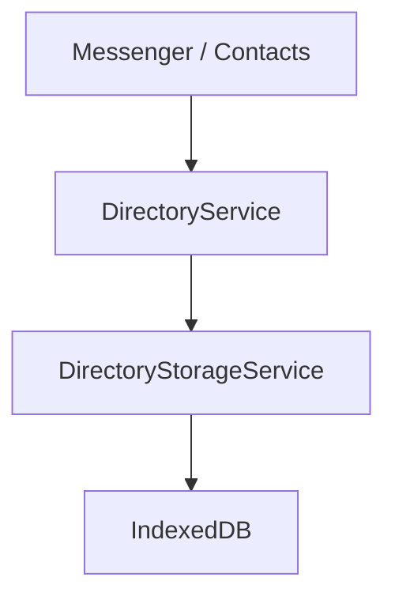

# 🧠 Directory Service (Domain)

**Scope:** `libs/directory/service`  
**Type:** `domain`

This library contains the **Business Logic** for the Directory. It serves as the primary API for other application scopes (like Messenger or Contacts) to interact with directory data.

> **Role:** "The Decider" — While currently a thin wrapper around storage, this is where future policy logic (e.g., "Is this user allowed to join?") will reside.

---

## 🚀 Key Responsibilities

1.  **API Implementation:** Implements the `DirectoryQueryApi` and `DirectoryMutationApi` interfaces defined in `@nx-platform-application/directory-api`.
2.  **Delegation:** Routes data requests to the `DirectoryStorageService` (Infrastructure Layer).
3.  **Time Management:** Responsible for generating timestamps (using `Temporal`) for mutations.

## 📦 Architecture



````

## 🛠️ Usage

This service should be injected by **State Management** libraries or **UI features** that need direct directory access.

```typescript
import { DirectoryService } from '@nx-platform-application/directory-service';

@Component({ ... })
export class MyComponent {
  private directory = inject(DirectoryService);

  async ngOnInit() {
    const user = await this.directory.getEntity(myUrn);
  }
}

```

````
