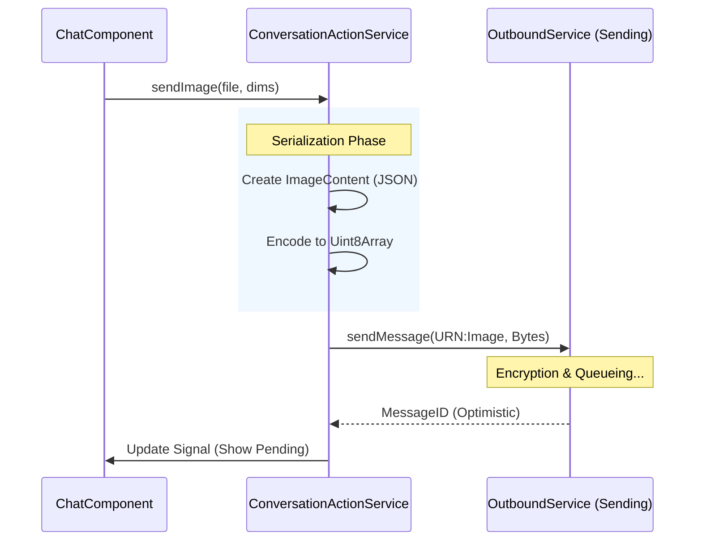

# 📨 Messenger Message Flow & Content Architecture

**Status:** Active
**Domains:** `conversation`, `message-content`
**Key Services:** `ConversationActionService`, `MessageContentParser`, `MessageViewMapper`

This document outlines the lifecycle of a message as it moves through the Domain Layer, specifically focusing on how we handle the **Hybrid Serialization** strategy (Raw Text vs. JSON Envelopes).

---

## 1. The Core Philosophy: "Content Envelope"

To minimize bandwidth for simple chats while supporting complex features (images, invites), we use a polymorphic serialization strategy based on the **URN Type ID**.

| Message Type | Type ID URN                     | Serialization                       |
| :----------- | :------------------------------ | :---------------------------------- |
| **Text**     | `urn:message:content:text`      | **Raw UTF-8 Bytes** (Zero overhead) |
| **Image**    | `urn:message:content:image`     | **JSON String** -> UTF-8 Bytes      |
| **Invite**   | `urn:message:type:group-invite` | **JSON String** -> UTF-8 Bytes      |
| **Typing**   | `urn:message:signal:typing`     | **Empty** (0 bytes)                 |

---

## 2. Outbound Flow (Sending)

The `ConversationActionService` acts as the **Facade** for all user intentions. It converts high-level intent into raw bytes before handing off to the Outbox.

### Step-by-Step

1.  **User Intent:** Component calls `actionService.sendImage(...)`.
2.  **Type Resolution:** Service selects the correct URN (e.g., `MessageTypeImage`).
3.  **Serialization:**
    - If Text: Encodes string directly.
    - If Rich Content: JSON.stringifies the interface (e.g., `ImageContent`) then encodes.
4.  **Handoff:** The `typeId` (URN) and `payload` (Uint8Array) are passed to `OutboundService` for encryption and queuing.

---

## 3. Inbound Flow (Viewing)

When messages arrive (or load from disk), they are raw encrypted bytes. The **Conversation Domain** is responsible for making them human-readable without polluting the database with UI logic.

### The `MessageViewMapper`

The `MessageViewMapper` is a **Lazy Decoder**. It ensures we don't burn CPU cycles decoding JSON/Text for messages that aren't currently on screen (though Angular virtual scrolling helps here).

- **Input:** `ChatMessage` (DB Record) containing `payloadBytes` (Uint8Array).
- **Logic:**
  1.  Checks `typeId`.
  2.  If `text`, uses `TextDecoder` (handling malformed UTF-8 gracefully).
  3.  If `image`, leaves bytes as-is (the Image Component will parse the JSON on demand or lazily).
- **Output:** `ChatMessage` with populated `textContent` or ready-to-use data.

---

## 4. The Content Parser Engine (`domain-message-content`)

This library sits at the center of the ecosystem. It is purely functional and has no dependencies on the Database or Network.

### Services

- **`MessageContentParser`:** The main entry point. It accepts a `URN` + `Uint8Array` and returns a discriminated union `ParsedMessage` (`content` | `signal` | `unknown`).
- **`MessageMetadataService`:** Handles the "Matryoshka Doll" wrapping. If a message has Tags or a specific Conversation Binding, the payload is wrapped in a metadata envelope:
  ```json
  {
    "c": "urn:conversation:1",
    "t": ["urn:tag:urgent"],
    "d": [ ...raw bytes... ]
  }
  ```

### Strategy Pattern

To avoid a massive `switch` statement, parsing is delegated to granular strategies:

- `TextParserStrategy`
- `ImageParserStrategy`
- `GroupParserStrategy`
- `SignalParserStrategy` (Typing, Read Receipts)

---

## 5. Sequence Diagram: Sending an Image



## Updates

# 📨 Messenger Message Flow & Content Architecture

**Status:** Active
**Domains:** `conversation`, `message-content`, `sending`, `outbox`

This document outlines the lifecycle of a message as it moves through the Domain Layer, specifically focusing on the **Strategy Pattern** for sending and the **Outbox Pattern** for reliability.

---

## 1. Outbound Flow (The "Send" Path)

Sending is a multi-stage pipeline designed to decouple "User Intent" from "Network Reality."

### Stage 1: Strategy Selection (`OutboundService`)

The service analyzes the `recipientUrn` to choose a strategy:

- **Direct Strategy:** If recipient is a User (`urn:contacts:user:bob`).
- **Network Group Strategy:** If recipient is a Cloud Group (`urn:messenger:group:team`).
- **Broadcast Strategy:** If recipient is a Local List (`urn:contacts:group:friends`).

### Stage 2: The "Handoff" (Strategy Execution)

The selected strategy performs **Optimistic Persistence** (saving to disk) and prepares the wire payload.

| Strategy          | Persistence                                                            | Wire Format                          |
| :---------------- | :--------------------------------------------------------------------- | :----------------------------------- |
| **Direct**        | Saves 1 message.                                                       | Wrapped Payload (`metadata + bytes`) |
| **Network Group** | Saves 1 message. Creates "Scorecard" (Receipt Map) for joined members. | Wrapped Payload (Single envelope)    |
| **Broadcast**     | Saves 1 "Main" message + N "Ghost" messages (for private chats).       | Wrapped Payload (Single envelope)    |

### Stage 3: The Outbox (`OutboxWorker`)

A background worker picks up the generic `OutboundMessageRequest` from the queue.

1.  **Resolution:** Resolves the recipient's canonical Network ID (JIT).
2.  **Encryption:** Encrypts the payload for the recipient's public keys.
3.  **Transmission:** Pushes to the API via `ChatSendService`.
4.  **Fan-Out:** For Groups, the worker loops through all participants, sending individual encrypted copies (Sealed Sender).

---

## 2. Inbound Flow (The "Receive" Path)

### Stage 1: The Airlock (`IngestionService`)

1.  **Decrypt:** Verifies signature and decrypts the envelope.
2.  **Gatekeeper:** `QuarantineService` checks if the sender is blocked or unknown.
3.  **Route:** Separates **Signals** (Receipts, Typing) from **Content** (Text, Images).

### Stage 2: Signal Handling

Signals are applied immediately and discarded.

- **Read Receipts:** Updates the `receiptMap` of the target message in `ChatStorage`.
- **Asset Reveal:** Patches a previous message to unlock high-res media.

### Stage 3: Content Parsing (`MessageContentParser`)

- **Unwrap:** Removes the metadata envelope (Conversation ID, Tags).
- **Strategy Parse:** Delegates to `TextParser`, `ImageParser`, etc.
- **Persist:** Saves the normalized `ChatMessage` to IndexedDB.

---

## 3. Scaling Policies

To ensure performance on mobile devices, we enforce strict limits on group features.

| Feature              | Tier 1 (Small)          | Tier 2 (Medium)         | Tier 3 (Large)                |
| :------------------- | :---------------------- | :---------------------- | :---------------------------- |
| **Size Limit**       | < 10 Members            | < 50 Members            | > 50 Members                  |
| **Receipt Tracking** | Full (Individual Names) | Full (Individual Names) | **Binary** (Sent/Failed only) |
| **Local Ghosts**     | Enabled (Appears in DM) | **Disabled**            | **Disabled**                  |
