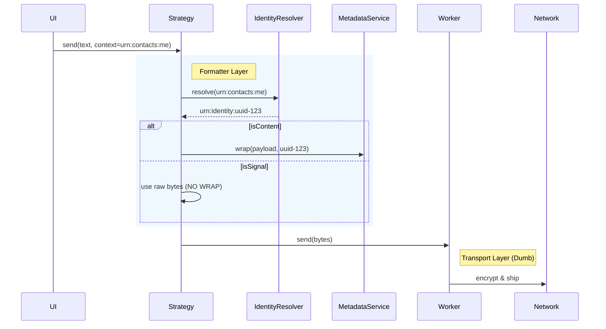
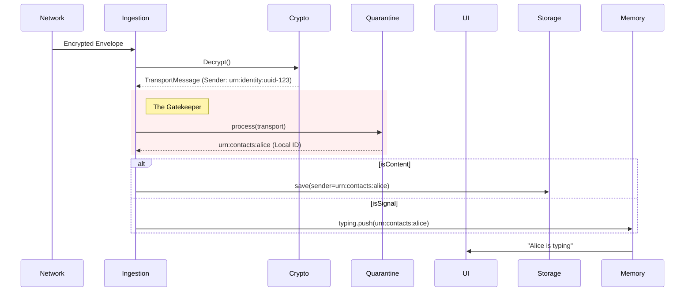

# Messaging Protocol & Identity Boundaries

**Status:** authoritative
**Scope:** `libs/messenger`

## 1. The Core Problem: Two Worlds

The application operates in two distinct namespaces. Mixing them up leads to routing failures (Typing Indicators not showing) or privacy leaks (sending local IDs to the network).

| World              | URN Namespace      | Scope   | Example                      | Description                                                       |
| ------------------ | ------------------ | ------- | ---------------------------- | ----------------------------------------------------------------- |
| **Local (Device)** | `urn:contacts:...` | Private | `urn:contacts:user:alice`    | The user's private view of a person. **NEVER** leaves the device. |
| **Network (Wire)** | `urn:identity:...` | Public  | `urn:identity:user:uuid-123` | The global cryptographic identity. **REQUIRED** for transport.    |

---

## 2. The Golden Rules

### Rule #1: "Resolve Before Wire" (Outbound)

- **Strategies are Formatters:** The Strategy (`DirectSend`, `NetworkGroup`) is responsible for converting Local URNs (Context) into Network URNs.
- **Worker is Dumb:** The `OutboxWorkerService` accepts opaque bytes. It does **not** know about "Context" or "Wrapping." It strictly handles encryption keys and delivery.
- **Violation:** Passing `urn:contacts:user:me` to the Worker. The Worker will encrypt it, and the recipient will receive "me" (which means _them_), breaking the thread.

### Rule #2: "Map at the Gate" (Inbound)

- **Quarantine is the Gatekeeper:** Identity resolution happens **once**, immediately after decryption.
- **One Identity:** Whether the payload is a 10MB video or a 0-byte signal, it is keyed by the **Local Contact URN** produced by the Quarantine service.
- **Violation:** Using `transport.senderId` (Network URN) for Typing Indicators while using `canonicalSenderUrn` (Contact URN) for Text Messages. This causes the UI (which listens to Contact URNs) to ignore the signal.

### Rule #3: "Signals are Flat"

- **Content (Text/Rich):** Is **Wrapped** in a Metadata Envelope (`{"c": "context", "d": "payload"}`).
- **Signals (Typing/Receipts):** Are **Raw/Flat** (`Uint8Array([])` or `JSON`). They are **NEVER** wrapped.
- **Why:** The Receiver's Parser expects signals to be lightweight. Wrapping them causes parsing errors.

---

## 3. The Architecture

### A. The Outbound Pipeline

### B. The Inbound Pipeline

---

## 4. Common Pitfalls (Don't Do This)

### ❌ The "Double Wrap"

- **Bug:** Strategy wraps the payload, then Worker wraps it again.
- **Symptom:** Receiver gets nested JSON `{"d": "{\"d\": ...}"}` and fails to parse.
- **Fix:** `OutboxWorkerService` must **never** call `metadataService.wrap()`.

### ❌ The "Leak"

- **Bug:** Strategy passes `urn:contacts:user:me` directly to the wrapper.
- **Symptom:** Recipient receives a message linked to _their_ "me" contact, merging it into the wrong conversation or creating a "Self Chat."
- **Fix:** Use `IdentityResolver` in the Strategy.

### ❌ The "Bypass"

- **Bug:** "Fast Lane" (Ephemeral) signals skip the Quarantine check to save time.
- **Symptom:** UI receives `urn:identity:uuid-123` instead of `Alice`. Typing indicator doesn't show up because UI is looking for `Alice`.
- **Fix:** All paths must pass through `QuarantineService.process()` to resolve the Identity.
