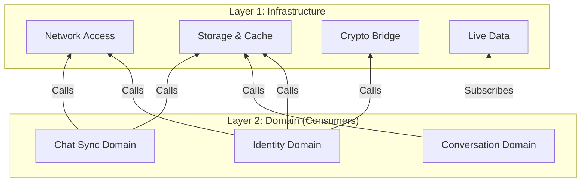

# Messenger Infrastructure Layer: The Foundation

## 🏗️ Overview

The **Infrastructure Layer** forms the physical foundation of the Messenger application. It provides the concrete tools and mechanisms required to interact with the outside world: the Network, the Disk, the Browser, and the Cryptographic Engine.

While the **Domain Layer** decides _what_ to do (Policy), the Infrastructure Layer knows _how_ to do it (Mechanism).

### The Core Mandate

1.  **Dumb Execution:** This layer does not contain business rules. It does not ask "Should I send this message?"; it simply sends bytes to a URL.
2.  **Abstraction:** It hides the complexity of external APIs (e.g., IndexedDB, Web Crypto, HTTP) behind clean, injectable Angular services.
3.  **Reliability:** It is responsible for handling low-level errors (network timeouts, disk quotas) and translating them into standard errors the Domain can understand.

---

## 🏛️ Architecture: Layer 1 (The Bottom)

In our **Layered Architecture**, this is the bottom-most layer.

### The Rules

1.  **No Upward Dependencies:** Infrastructure **never** imports from Domain, State, or UI. It only imports from `Platform Types` (Kernel).
    - _Exception:_ In strict "Ports & Adapters" scenarios (like `ConversationStorage`), it implements an interface defined in the Domain.
2.  **Pure Mechanism:** If you are writing an `if` statement about User Roles or Message Types, you are in the wrong layer. That belongs in Domain.
3.  **Input/Output:** This layer takes in standard objects and outputs standard objects (or `Promises`/`Observables` of them).

---

## 🔌 Library Catalog

The infrastructure is organized by the **Technical Capability** it provides.

### 1. Network Access (HTTP)

**Role:** The REST Client. Wraps `HttpClient` to communicate with backend microservices.

- **Chat Access (`infrastructure-chat-access`):**
  - Endpoints for sending messages (`POST /messages`).
  - Endpoints for fetching conversation history.
  - Handles Auth headers and basic retry logic.
- **Key Access (`infrastructure-key-access`):**
  - Endpoints for publishing Identity Keys.
  - Endpoints for looking up other users' keys.
- **Device Notifications (`infrastructure-device-notifications`):**
  - Handles the VAPID handshake with the Push Service.
  - Registers the browser's Service Worker for push alerts.

### 2. Real-Time Data (WebSockets)

**Role:** The Live Connection.

- **Chat Live Data (`infrastructure-chat-live-data`):**
  - Wraps the WebSocket connection.
  - Maintains the "Heartbeat".
  - Exposes a stream of incoming events (`incomingMessage$`, `typing$`).
  - **Note:** This is "Dumb Pipes." It pushes raw data to the `Ingestion` domain; it doesn't parse it.

### 3. Persistence (IndexedDB)

**Role:** The Local Database. Wraps `Dexie.js` to provide type-safe storage.

- **DB Schema (`infrastructure-db-schema`):**
  - **The Source of Truth.** Defines the exact shape of every record stored in IndexedDB (`MessageRecord`, `ConversationRecord`).
  - Contains **Mappers** that translate between `Domain Objects` (rich logic) and `Storage Records` (flat data).
  - Ensures different storage libraries speak the same language.
- **Chat Storage (`infrastructure-chat-storage`):**
  - Stores `Conversations` and `Messages`.
  - Manages indexes for fast querying (e.g., "Find all messages in Conversation X").
- **Key Storage (`infrastructure-key-storage`):**
  - Stores the Public Keys of known contacts.
  - Stores the Private Identity Keys of the current user (Exportable/Non-Exportable).
- **Key Cache (`infrastructure-key-cache`):**
  - A "Smart Repository" implementation.
  - Orchestrates `KeyAccess` (Network) and `KeyStorage` (Disk) to provide a "Read-Through" cache strategy (Stale-While-Revalidate).

### 4. Security

**Role:** The Cryptographic Engine.

- **Crypto Bridge (`infrastructure-crypto-bridge`):**
  - Wraps the browser's `Web Crypto API` (SubtleCrypto).
  - **Responsibilities:**
    - Generating RSA-OAEP / ECDSA Keypairs.
    - Encrypting/Decrypting payloads (AES-GCM).
    - Signing messages and verifying signatures.
  - **Why a Bridge?** The Web Crypto API is complex and verbose. This bridge provides a simplified, high-level API (e.g., `encryptPayload(data, key)`).

---

## 🛠️ Developer Guide: Working in Infrastructure

### Adding a New API Endpoint

1.  Go to `infrastructure-chat-access` (or relevant lib).
2.  Add the method to the Service.
3.  Use `HttpClient` to make the request.
4.  **Do not** add logic to interpret the result beyond basic success/failure. Return the raw data (or specific DTO) to the Domain.

### Changing the Database Schema

1.  Go to `infrastructure-chat-storage` (or relevant lib).
2.  Update the `Dexie` schema definition.
3.  **Crucial:** If you change the schema, you must implement a migration strategy or a "Wipe and Rebuild" logic if acceptable for the feature.

### Mocking for Tests

Because Infrastructure deals with "Hard Dependencies" (Browser APIs, Network), these libraries are the primary targets for **Mocking** in Domain tests.

- **Domain Unit Tests:** Should _always_ use a Mock version of these infrastructure services (e.g., `MockCryptoService`, `MockStorageService`).
- **Infrastructure Unit Tests:** Should use mocks for the low-level browser APIs (e.g., `HttpTestingController`, `fakeIndexedDB`).

---

## 🔄 Interaction Diagram

