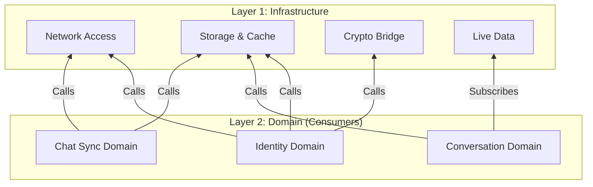
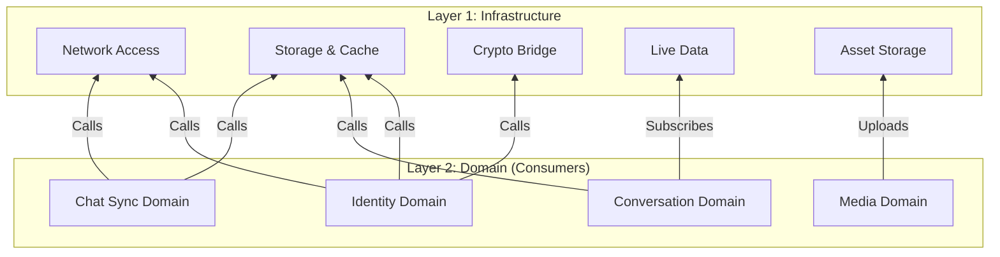

# Messenger Infrastructure Layer: The Foundation

## 🏗️ Overview

The **Infrastructure Layer** forms the physical foundation of the Messenger application. It provides the concrete tools and mechanisms required to interact with the outside world: the Network, the Disk, the Browser, and the Cryptographic Engine.

While the **Domain Layer** decides _what_ to do (Policy), the Infrastructure Layer knows _how_ to do it (Mechanism).

### The Core Mandate

1.  **Dumb Execution:** This layer does not contain business rules. It does not ask "Should I send this message?"; it simply sends bytes to a URL.
2.  **Abstraction:** It hides the complexity of external APIs (e.g., IndexedDB, Web Crypto, HTTP) behind clean, injectable Angular services.
3.  **Reliability:** It is responsible for handling low-level errors (network timeouts, disk quotas) and translating them into standard errors the Domain can understand.

---

## 🏛️ Architecture: Layer 1 (The Bottom)

In our **Layered Architecture**, this is the bottom-most layer.

### The Rules

1.  **No Upward Dependencies:** Infrastructure **never** imports from Domain, State, or UI. It only imports from `Platform Types` (Kernel).
    - _Exception:_ In strict "Ports & Adapters" scenarios (like `ConversationStorage`), it implements an interface defined in the Domain.
2.  **Pure Mechanism:** If you are writing an `if` statement about User Roles or Message Types, you are in the wrong layer. That belongs in Domain.
3.  **Input/Output:** This layer takes in standard objects and outputs standard objects (or `Promises`/`Observables` of them).

---

## 🔌 Library Catalog

The infrastructure is organized by the **Technical Capability** it provides.

### 1. Network Access (HTTP)

**Role:** The REST Client. Wraps `HttpClient` to communicate with backend microservices.

- **Chat Access (`infrastructure-chat-access`):**
  - Endpoints for sending messages (`POST /messages`).
  - Endpoints for fetching conversation history.
  - Handles Auth headers and basic retry logic.
- **Key Access (`infrastructure-key-access`):**
  - Endpoints for publishing Identity Keys.
  - Endpoints for looking up other users' keys.
- **Device Notifications (`infrastructure-device-notifications`):**
  - Handles the VAPID handshake with the Push Service.
  - Registers the browser's Service Worker for push alerts.

### 2. Real-Time Data (WebSockets)

**Role:** The Live Connection.

- **Chat Live Data (`infrastructure-chat-live-data`):**
  - Wraps the WebSocket connection.
  - Maintains the "Heartbeat".
  - Exposes a stream of incoming events (`incomingMessage$`, `typing$`).
  - **Note:** This is "Dumb Pipes." It pushes raw data to the `Ingestion` domain; it doesn't parse it.

### 3. Persistence (IndexedDB)

**Role:** The Local Database. Wraps `Dexie.js` to provide type-safe storage.

- **DB Schema (`infrastructure-db-schema`):**
  - **The Source of Truth.** Defines the exact shape of every record stored in IndexedDB (`MessageRecord`, `ConversationRecord`).
  - Contains **Mappers** that translate between `Domain Objects` (rich logic) and `Storage Records` (flat data).
  - Ensures different storage libraries speak the same language.
- **Chat Storage (`infrastructure-chat-storage`):**
  - Stores `Conversations` and `Messages`.
  - Manages indexes for fast querying (e.g., "Find all messages in Conversation X").
- **Key Storage (`infrastructure-key-storage`):**
  - Stores the Public Keys of known contacts.
  - Stores the Private Identity Keys of the current user (Exportable/Non-Exportable).

### 4. Security & Caching

**Role:** The Trust Engine.

- **Private Keys (`private-keys`):**
  - **Role:** The Mechanic (Local Vault).
  - Wraps `IndexedDB` to securely store the user's Identity Keys.
  - Provides the low-level `CryptoEngine` wrapper for `Web Crypto API`.
- **Message Security (`message-security`):**
  - **Role:** The Protocol (Sealed Sender).
  - Stateless service that implements the "Sign-then-Encrypt" and "Decrypt-then-Verify" pipeline.
  - Consumes `TransportMessage` and produces `SecureEnvelope`.
- **Pairing Security (`pairing-security`):**
  - **Role:** The Handshake (Device Linking).
  - Generates and parses the ephemeral QR payloads (`rh` / `sh` modes) used to link a new device.
- **Key Cache (`key-cache`):**
  - **Read-Through Cache.** Orchestrates `KeyAccess` (Network) and `KeyStorage` (Disk).
  - Implements TTL (Time-To-Live) logic to auto-rotate stale keys.

---

## 🛠️ Developer Guide: Working in Infrastructure

### Adding a New API Endpoint

1.  Go to `infrastructure-chat-access` (or relevant lib).
2.  Add the method to the Service.
3.  Use `HttpClient` to make the request.
4.  **Do not** add logic to interpret the result beyond basic success/failure. Return the raw data (or specific DTO) to the Domain.

### Changing the Database Schema

1.  Go to `infrastructure-chat-storage` (or relevant lib).
2.  Update the `Dexie` schema definition.
3.  **Crucial:** If you change the schema, you must implement a migration strategy or a "Wipe and Rebuild" logic if acceptable for the feature.

### Mocking for Tests

Because Infrastructure deals with "Hard Dependencies" (Browser APIs, Network), these libraries are the primary targets for **Mocking** in Domain tests.

- **Domain Unit Tests:** Should _always_ use a Mock version of these infrastructure services (e.g., `MockCryptoService`, `MockStorageService`).
- **Infrastructure Unit Tests:** Should use mocks for the low-level browser APIs (e.g., `HttpTestingController`, `fakeIndexedDB`).

---

## 🔄 Interaction Diagram

```mermaid
graph BT
    %% BT = Bottom to Top direction

    subgraph "Layer 1: Infrastructure"
        Net[Network Access]
        DB[Storage & Cache]
        Crypto[Crypto Bridge]
        Realtime[Live Data]
    end

    subgraph "Layer 2: Domain (Consumers)"
        Identity[Identity Domain]
        Convo[Conversation Domain]
        Sync[Chat Sync Domain]
    end

    %% Dependencies (Domain depends on Infra)
    Identity --> |Calls| Crypto
    Identity --> |Calls| Net
    Identity --> |Calls| DB

    Convo --> |Calls| DB
    Convo --> |Subscribes| Realtime

    Sync --> |Calls| Net
    Sync --> |Calls| DB
```

### Update to be merged in:

# 🏛️ Messenger Infrastructure Layer: The Foundation

## 🏗️ Overview

The **Infrastructure Layer** forms the physical foundation of the Messenger application. It provides the concrete tools and mechanisms required to interact with the outside world: the Network, the Disk, the Browser, and the Cryptographic Engine.

While the **Domain Layer** decides _what_ to do (Policy), the Infrastructure Layer knows _how_ to do it (Mechanism).

### The Core Mandate

1.  **Dumb Execution:** This layer does not contain business rules. It does not ask "Should I send this message?"; it simply sends bytes to a URL.
2.  **Abstraction:** It hides the complexity of external APIs (e.g., IndexedDB, Web Crypto, HTTP) behind clean, injectable Angular services.
3.  **Reliability:** It is responsible for handling low-level errors (network timeouts, disk quotas) and translating them into standard errors the Domain can understand.

---

## 🔌 Library Catalog

The infrastructure is organized by the **Technical Capability** it provides.

### 1. Network Access (HTTP & WSS)

**Role:** The Communications Link. Wraps `HttpClient` and `WebSocket` to talk to the outer world.

- **Chat Access (`chat-access`):**
  - Implements the **Poke-then-Pull** protocol.
  - `ChatDataService`: Fetches queued messages (`GET /messages`) and handles ACKs.
  - `ChatSendService`: Pushes encrypted envelopes (`POST /send`).
- **Live Data (`live-data`):**
  - Manages the WebSocket connection.
  - "Dumb Pipe" that listens for the `void` "Poke" signal to trigger ingestion.
  - Handles exponential backoff and connection resilience.
- **Key Access (`key-access`):**
  - Fetches Public Keys for identity verification (`GET /keys/:urn`).
  - Publishes the user's own Public Keys.
- **Device Notifications (`device-notifications`):**
  - Manages the **Offline Channel**.
  - Registers the browser Service Worker to receive VAPID Push Notifications when the app is closed.

### 2. Persistence (IndexedDB)

**Role:** The Local Database. Wraps `Dexie.js` to provide type-safe, offline-first storage.

- **DB Schema (`db-schema`):**
  - **The Source of Truth.** Defines the exact shape of every record (`MessageRecord`, `ConversationIndexRecord`).
  - Contains **Mappers** to translate between rich Domain Objects and flat Storage Records.
- **Chat Storage (`chat-storage`):**
  - **The Heavy Lifter.** Manages `messages`, `conversations`, `outbox`, `quarantined_messages`, and `tombstones`.
  - Uses **Strategy Pattern** for complex atomic operations:
    - `ChatDeletionStrategy`: Handles "Index Rollback" when the latest message is deleted.
    - `ChatMergeStrategy`: Handles "Last-Write-Wins" merging of conversation indexes.
- **Key Storage (`key-storage`):**
  - Isolated database (`messenger_keys`) for storing Public Keys.
  - Allows wiping keys (Logout) without destroying chat history.
- **Local Settings (`local-settings`):**
  - **User Intent Store.** Persists active user choices (e.g., "Wizard Seen", "Drive Consent").
  - Distinct from system config; this is the "Contract" with the user.

### 3. Cloud & Assets (BYOS)

**Role:** The Bridge to User-Owned Storage.

- **Asset Storage (`asset-storage`):**
  - Implements the **Bring Your Own Storage (BYOS)** pattern.
  - Adapts the generic Platform Storage (Google Drive, etc.) for Messenger use.
  - Enforces MIME types to prevent "Garbage Text" uploads.

### 4. Security & Caching

**Role:** The Trust Engine.

- **Crypto Bridge (`crypto-bridge`):**
  - Wraps the browser's `Web Crypto API`.
  - Handles **Hybrid Encryption** (AES-GCM + RSA-OAEP) and **Signing** (RSA-PSS).
  - Manages the "Device Pairing" ceremony (QR Code generation/parsing).
- **Key Cache (`key-cache`):**
  - **Read-Through Cache.** Orchestrates `KeyAccess` (Network) and `KeyStorage` (Disk).
  - Implements TTL (Time-To-Live) logic to auto-rotate stale keys.

---

## 🛠️ Developer Guide: Working in Infrastructure

### Adding a New API Endpoint

1.  Go to `chat-access` (or relevant lib).
2.  Add the method to the Service.
3.  Use `HttpClient` to make the request.
4.  **Do not** add logic to interpret the result beyond basic success/failure. Return the raw data (or specific DTO) to the Domain.

### Changing the Database Schema

1.  Go to `db-schema`.
2.  Update the `MessengerDatabase` class version number.
3.  **Crucial:** If you change the schema, you must implement a migration strategy or a "Wipe and Rebuild" logic if acceptable for the feature.

### Mocking for Tests

Because Infrastructure deals with "Hard Dependencies" (Browser APIs, Network), these libraries are the primary targets for **Mocking** in Domain tests.

- **Domain Unit Tests:** Should _always_ use a Mock version of these infrastructure services (e.g., `MockCryptoService`, `MockStorageService`).
- **Infrastructure Unit Tests:** Should use mocks for the low-level browser APIs (e.g., `HttpTestingController`, `fakeIndexedDB`).

---

## 🔄 Interaction Diagram

```mermaid
graph BT
    %% BT = Bottom to Top direction

    subgraph "Layer 1: Infrastructure"
        Net[Network Access]
        DB[Storage & Cache]
        Crypto[Crypto Bridge]
        Realtime[Live Data]
        Cloud[Asset Storage]
    end

    subgraph "Layer 2: Domain (Consumers)"
        Identity[Identity Domain]
        Convo[Conversation Domain]
        Sync[Chat Sync Domain]
        Media[Media Domain]
    end

    %% Dependencies (Domain depends on Infra)
    Identity --> |Calls| Crypto
    Identity --> |Calls| Net
    Identity --> |Calls| DB

    Convo --> |Calls| DB
    Convo --> |Subscribes| Realtime

    Sync --> |Calls| Net
    Sync --> |Calls| DB

    Media --> |Uploads| Cloud
```
