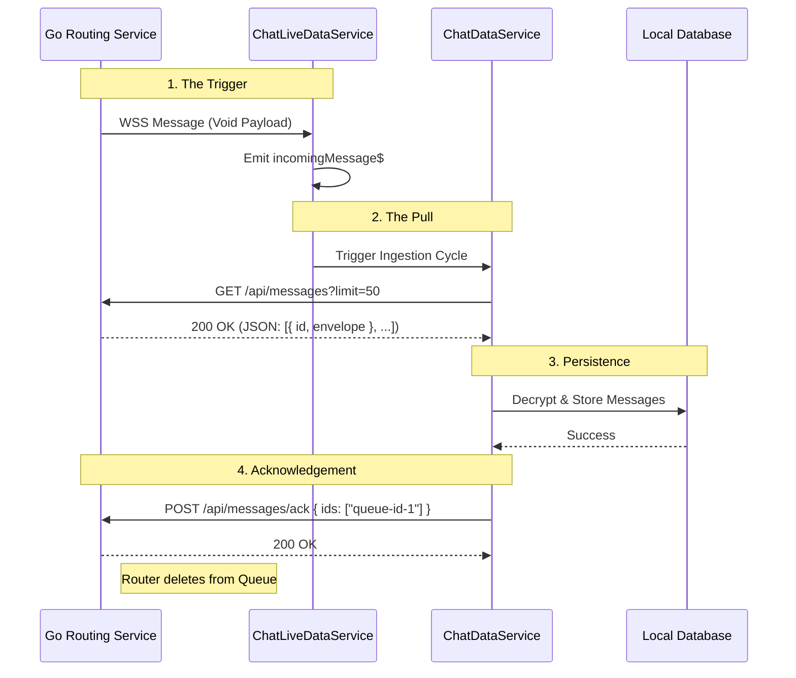
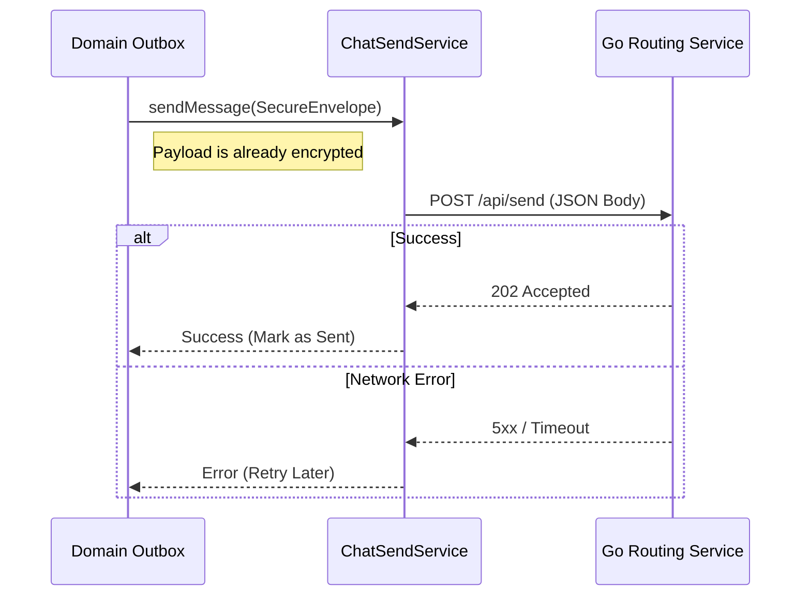
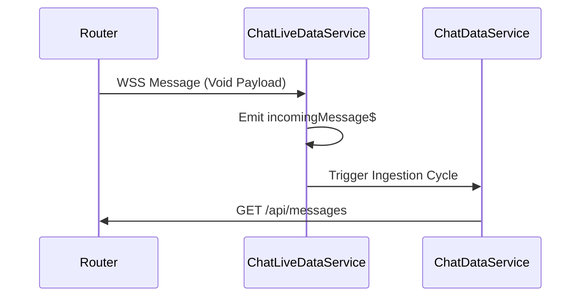
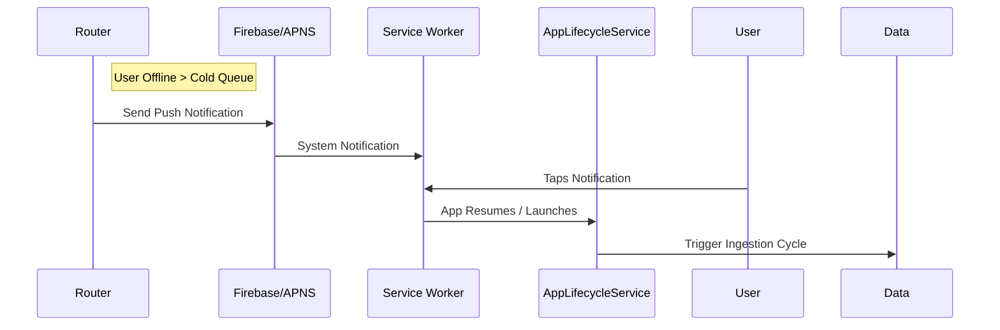

# 📡 Messenger Client <-> Router Protocol

**Status:** Active
**Architecture:** "Poke-then-Pull"
**Components:** `chat-access`, `live-data`
**Server Ref:** `go-routing-service`

This document defines the communication standard between the **Messenger Angular Client** and the **Go Routing Service**. The system uses a hybrid **WebSocket + REST** approach to maximize battery life and reliability on mobile devices.

---

## 1. Core Concept: "Poke-then-Pull"

Unlike traditional chat apps that push heavy data over a WebSocket, we treat the WebSocket purely as a **signaling channel**.

1.  **The Poke:** The server sends a lightweight, content-less signal (`void`) over the WebSocket to say "You have mail."
2.  **The Pull:** The client wakes up and fetches the actual data via a standard REST API.

**Why?**

- **Resilience:** If the socket drops during a large file transfer, we don't lose the data stream. REST ranges/retries are more robust.
- **Battery:** We don't need to keep the radio hot for keep-alives with heavy payloads.
- **Simplicity:** The WebSocket logic is extremely dumb. It doesn't need to know about encryption, envelopes, or binary formats.

---

## 2. Component Roles

| Service                   | Lib                 | Protocol        | Role                                                                                              |
| :------------------------ | :------------------ | :-------------- | :------------------------------------------------------------------------------------------------ |
| **`ChatLiveDataService`** | `infra/live-data`   | **WSS**         | **The Listener.** Maintains the persistent connection. Emits a `void` signal when a poke arrives. |
| **`ChatDataService`**     | `infra/chat-access` | **HTTP (GET)**  | **The Fetcher.** Reacts to the signal, downloads queued messages, and acknowledges receipt.       |
| **`ChatSendService`**     | `infra/chat-access` | **HTTP (POST)** | **The Sender.** Pushes encrypted envelopes to the router for delivery.                            |

---

## 3. Inbound Flow (Receiving Messages)



### Critical Details

- **Idempotency:** The `ack` is critical. Until the client sends the ACK, the Router keeps the messages in the queue.
- **Throttling:** The `ChatDataService` throttles pokes to prevent hammering the API.
- **Ordering (Hot vs Cold):** The server implements a **"Hot First"** delivery rule.
- The client may receive **Newer** messages (from Redis Hot Queue) _before_ **Older** messages (from Firestore Cold Queue).
- **Implication:** The Client Database MUST rely on its own sorting logic (`sentTimestamp` index), not the arrival order of batches.

---

## 4. Outbound Flow (Sending Messages)

Sending is a stateless "Fire and Forget" operation.



---

## 5. API Specification

### A. WebSocket (Signaling)

- **URL:** `wss://{host}/connect`
- **Auth:** JWT Token passed in the WebSocket **Protocol** header.
- **Behavior:**
- **Connect:** Client sends JWT.
- **Poke:** Router sends binary/text frame. Content is ignored.

### B. REST (Data)

**1. Fetch Messages**

- **GET** `/api/messages`
- **Query Params:** `?limit=50`
- **Response:**

```json
{
  "messages": [
    {
      "id": "queue-record-id-1", // <-- SERVER QUEUE ID (Use for ACK)
      "envelope": {
        // <-- CLIENT DATA (Encrypted)
        "recipientId": "...",
        "encryptedData": "..."
      }
    }
  ]
}
```

- **Note:** The `id` field is the **Server's Delivery ID**. Do not confuse this with the `messageId` hidden inside the encrypted envelope.

**2. Acknowledge Messages**

- **POST** `/api/messages/ack`
- **Body:**

```json
{
  "messageIds": ["queue-record-id-1", "queue-record-id-2"]
}
```

**3. Send Message**

- **POST** `/api/send`
- **Body:** (Serialized `SecureEnvelope`)

---

## 6. Resilience & Offline Strategy

### Online: WebSocket

- **Detection:** `ChatLiveDataService` observes socket closure.
- **Recovery:** Exponential Backoff (1s, 2s, 4s...).
- **Reconnection:** Triggers an immediate **Pull** to catch up.

### Offline: Push Notifications

- **Server Logic:** If the WebSocket is disconnected, the Router routes messages to the **Cold Queue** and triggers a **Push Notification** (FCM/APNS).
- **Client Logic:** Tapping a notification launches the app, which triggers `AppLifecycleService.resumed$`.
- **Action:** The app forces a **reconnect + pull** sequence, fetching the pending messages from the Cold Queue.

## doc update for online/offline

I have reviewed the **Device Notifications Infrastructure** (`libs/messenger/infrastructure/device-notifications`).

### 🟢 Status: Approved

This library is the final piece of the "Reliability Puzzle." It provides the **Offline Poke** mechanism required by the Routing Service.

### 🔎 Review Findings

**1. Architecture (`PushNotificationService`)**

- **Adapter Pattern:** The `notification.adapter.ts` is a critical piece of plumbing. Browser Push APIs return raw `ArrayBuffers` (or nulls), while your Domain expects strict `Uint8Array`. The adapter handles this conversion safely, preventing runtime crashes in the crypto layer.
- **State Management:** Exposing `permissionStatus` and `isSubscribed` as Signals is perfect for the UI (e.g., showing a "Enable Notifications" banner).

**2. Resilience**

- **Graceful Degrade:** In `disableNotifications`, if the backend API call fails (network down), it _still_ unsubscribes the Service Worker locally. This prevents the "Zombie Notification" bug where a user thinks they disabled alerts but the browser keeps showing them.

**3. Security**

- **VAPID Injection:** Using an `InjectionToken` for the `VAPID_PUBLIC_KEY` allows environment-specific keys (Dev vs Prod) without code changes.

### 📝 Documentation Update (more online/offline detail to be merged in)

# 📡 Messenger Client <-> Router Protocol

**Status:** Active
**Architecture:** "Poke-then-Pull"
**Components:** `chat-access`, `live-data`, `device-notifications`
**Server Ref:** `go-routing-service`

This document defines the communication standard between the **Messenger Angular Client** and the **Go Routing Service**. The system uses a hybrid **WebSocket + REST + Push** approach to maximize battery life and reliability on mobile devices.

---

## 1. Core Concept: "Poke-then-Pull"

Unlike traditional chat apps that push heavy data over a WebSocket, we treat the WebSocket purely as a **signaling channel**.

1.  **The Poke:** The server sends a lightweight signal (`void`) to say "You have mail."
2.  **The Pull:** The client wakes up and fetches the actual data via a standard REST API.

**Why?**

- **Resilience:** If the socket drops during a large file transfer, we don't lose the data stream. REST ranges/retries are more robust.
- **Battery:** We don't need to keep the radio hot for keep-alives with heavy payloads.

---

## 2. Component Roles

| Service                       | Lib                          | Protocol        | Role                                                                                                           |
| :---------------------------- | :--------------------------- | :-------------- | :------------------------------------------------------------------------------------------------------------- |
| **`ChatLiveDataService`**     | `infra/live-data`            | **WSS**         | **The Online Listener.** Maintains the persistent connection. Emits a `void` signal when a poke arrives.       |
| **`PushNotificationService`** | `infra/device-notifications` | **WebPush**     | **The Offline Listener.** Registers the browser service worker to receive system pokes when the app is closed. |
| **`ChatDataService`**         | `infra/chat-access`          | **HTTP (GET)**  | **The Fetcher.** Reacts to the signal, downloads queued messages, and acknowledges receipt.                    |
| **`ChatSendService`**         | `infra/chat-access`          | **HTTP (POST)** | **The Sender.** Pushes encrypted envelopes to the router for delivery.                                         |

---

## 3. Inbound Flow (Receiving Messages)

### Scenario A: App is Open (Online)



### Scenario B: App is Closed (Offline)



---

## 4. Resilience & Offline Strategy

### Online: WebSocket

- **Detection:** `ChatLiveDataService` observes socket closure.
- **Recovery:** Exponential Backoff (1s, 2s, 4s...).
- **Reconnection:** Triggers an immediate **Pull** to catch up.

### Offline: Push Notifications

- **Server Logic:** If the WebSocket is disconnected, the Router routes messages to the **Cold Queue** and triggers a **Push Notification**.
- **Client Logic:** Tapping a notification launches the app, which triggers `AppLifecycleService.resumed$`.
- **Action:** The app forces a **reconnect + pull** sequence, fetching the pending messages from the Cold Queue.
