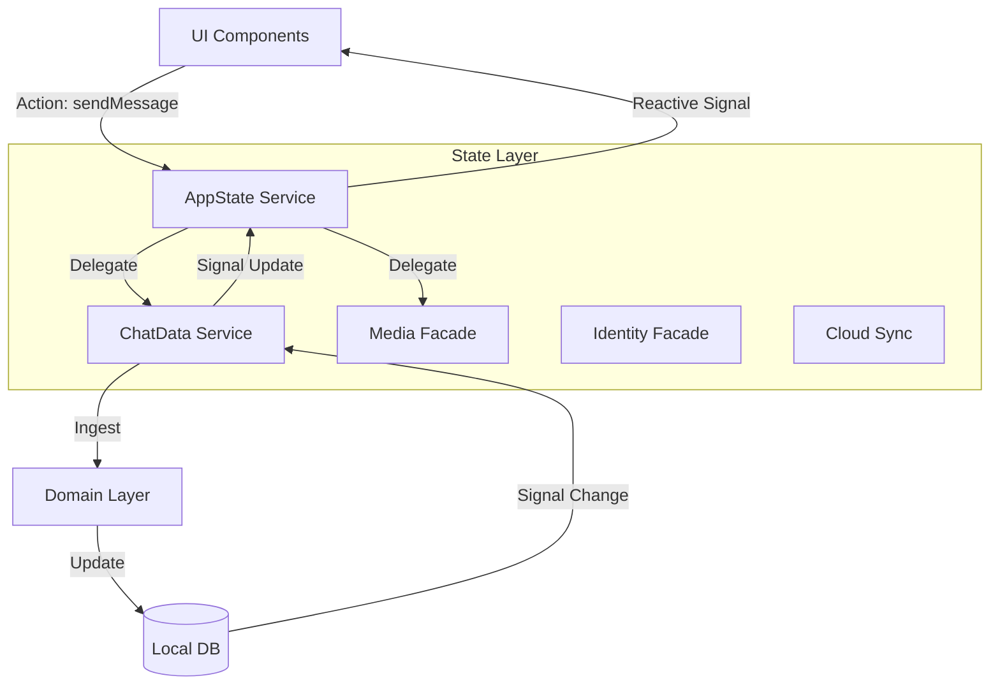

# 🧠 Messenger State Layer

**Scope:** `libs/messenger/state/*`

The **State Layer** is the "Brain" of the Messenger application. It sits between the **UI Components** (View) and the **Domain/Infrastructure Layers** (Logic/Data).

Its primary responsibility is **Orchestration**: coordinating complex, multi-step workflows (like "Send Image" or "Link Device") into simple, reactive signals that the UI can consume.

---

## 🏛️ Architectural Pattern: The "Hub & Spoke"

We do not have a single massive "Store". Instead, we use a **Federated State** architecture where a central orchestrator (`app`) delegates to specialized domain facades.

### 1. The Hub (Central Nervous System)

- **`@nx-platform-application/messenger-state-app`**
  - **Role:** The **Application Orchestrator**.
  - **Responsibility:** This is the _only_ service the root `AppComponent` should inject. It manages the application lifecycle (Boot -> Auth -> Sync -> Ready). It aggregates signals from all other state libraries to provide a unified view of the world (e.g., `isOnline`, `activeConversations`, `currentUser`).

### 2. The Spokes (Specialized Workers)

These libraries handle the state machines for specific sub-domains. They are often injected into the `AppState` service, but can also be used directly by specific UI features (e.g., a Settings page using `CloudSyncService`).

| Library                          | Role                   | Key Responsibility                                                                                                                                                |
| :------------------------------- | :--------------------- | :---------------------------------------------------------------------------------------------------------------------------------------------------------------- |
| **`messenger-state-chat-data`**  | **The Engine Room**    | Manages the **Data Loop**. Connects WebSocket events to the Ingestion pipeline. It pumps data into the local database and updates the `activeConversations` list. |
| **`messenger-state-identity`**   | **The Gatekeeper**     | Manages **Authentication & Keys**. Handles the "Onboarding Ceremony," device pairing (QR Codes), and cryptographic identity reset.                                |
| **`messenger-state-cloud-sync`** | **The Backup Manager** | Orchestrates **Disaster Recovery**. Manages OAuth tokens (Google/Apple), detects "Popup Blocked" states, and runs the Contact/Message backup sequence.            |
| **`messenger-state-media`**      | **The Asset Worker**   | Manages **Long-Running Uploads**. handles the "Optimistic UI" for images/videos, performs background uploads, and sends the "Asset Reveal" signal when done.      |
| **`messenger-state-moderation`** | **The Safety Guard**   | Manages **Trust**. Syncs block lists and handles the "Quarantine Zone" where messages from unknown senders wait for user approval.                                |

---

## 🔄 The Data Flow

### ⚠️ Rules of Engagement

- No Business Logic: State services should not parse binaries or validate emails. They delegate to Domain Services.

- No Raw HTTP: State services should not make fetch calls. They delegate to Infrastructure Services.

- Signals First: All public state must be exposed as Angular Signal<T> (or computed).

- Orchestration Only: If a feature requires coordinating Auth, Storage, and Network, it belongs here. If it's just "Save to DB", it belongs in Domain.
